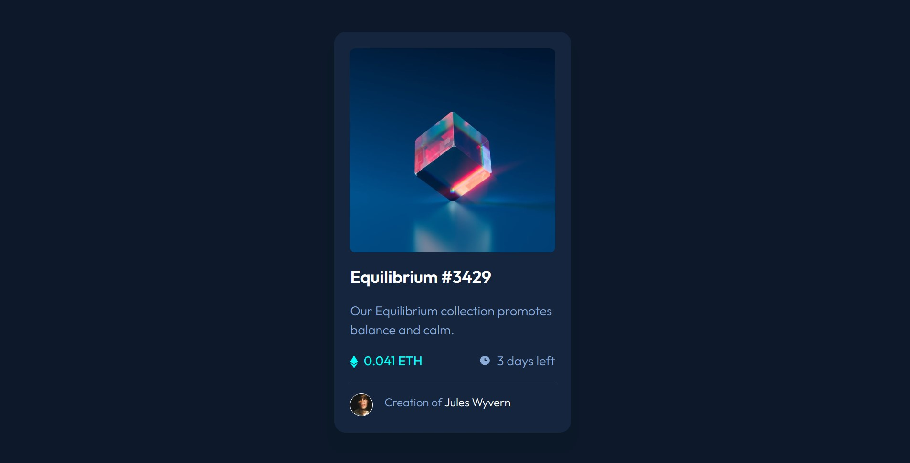

# Frontend Mentor - NFT preview card component solution

This is a solution to the [NFT preview card component challenge on Frontend Mentor](https://www.frontendmentor.io/challenges/nft-preview-card-component-SbdUL_w0U). Frontend Mentor challenges help you improve your coding skills by building realistic projects.

## Table of contents

- [Overview](#overview)
  - [The challenge](#the-challenge)
  - [Screenshot](#screenshot)
  - [Links](#links)
- [My process](#my-process)
  - [Built with](#built-with)
  - [What I learned](#what-i-learned)
  - [Continued development](#continued-development)
  - [Useful resources](#useful-resources)
- [Author](#author)
- [Acknowledgments](#acknowledgments)

## Overview

### The challenge

Users should be able to:

- View the optimal layout depending on their device's screen size
- See hover states for interactive elements

### Screenshot



### Links

- Solution URL: [Add solution URL here](https://your-solution-url.com)
- Live Site URL: [Add live site URL here](https://your-live-site-url.com)

## My process

### Built with

- Semantic HTML5 markup
- CSS custom properties
- Flexbox
- CSS Grid
- Mobile-first workflow

### What I learned

I used this project to reinforce my understanding of the ::before psuedo element. It taught me that it doesnt work on images, and I learned how to use it for the overlay.
Speaking of overlays, I learned one way of implementing one. It was challenging, but it was fun becuase it also reinforces my understanding of position : relative and position : absolute.

```css
.overlay__square {
  width: 100%;
  height: 100%;
  background-color: hsla(178, 100%, 50%, 0.5);
  border-radius: 0.5rem;

  position: absolute;
  top: 0;

  opacity: 0;
}
.overlay__square::before {
  content: url(images/icon-view.svg);
  position: absolute;
  top: 42%;
  left: 42%;
}

.overlay__square:hover {
  transition: opacity 0.2s ease-in-out;
  opacity: 1;
  cursor: pointer;
}
```

### Continued development

I want to continue using the before and after psuedo elements, but in new ways. I saw a video by kevin powell that mentioned we can use it for stylistic elements, so I'd like to do that in the future.
I would also like to learn how to implement animations in my projects, so I think I will look into and experiment with that in the future.

### Useful resources

- [MDN](https://developer.mozilla.org/en-US/) - This recource is my go to whenever I need to learn about things more in detail. I'm always referencing it to teach myself about new elements properties, or functions.

## Author

- Frontend Mentor - [@Moses2308](https://www.frontendmentor.io/profile/Moses2308)
- Dev - (https://dev.to/moses2308)
